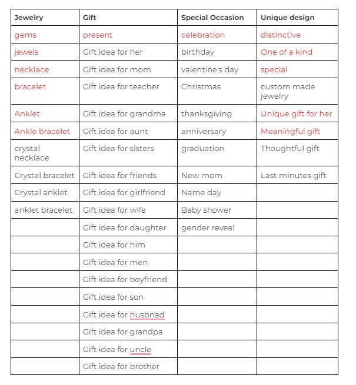
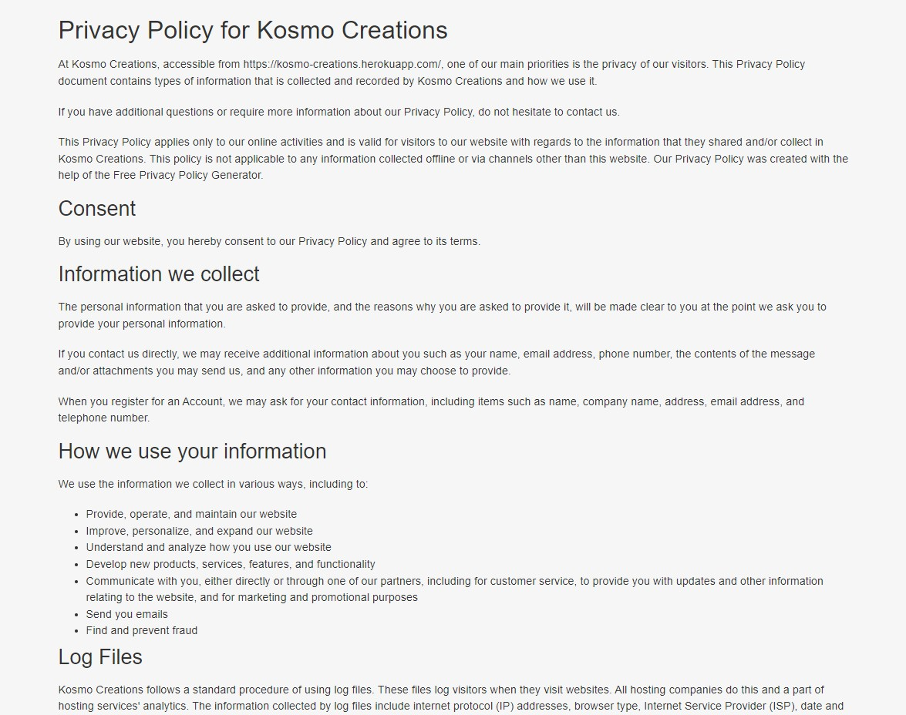
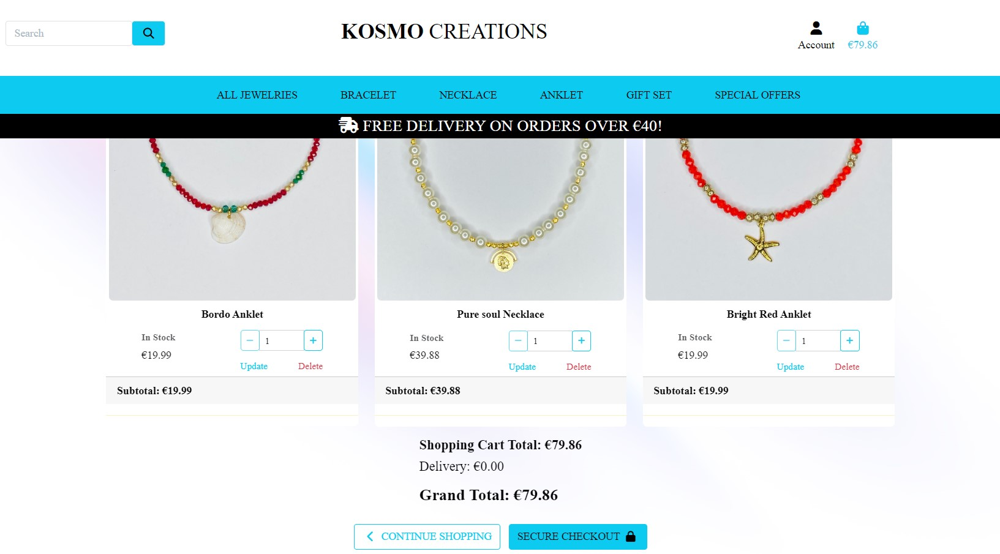
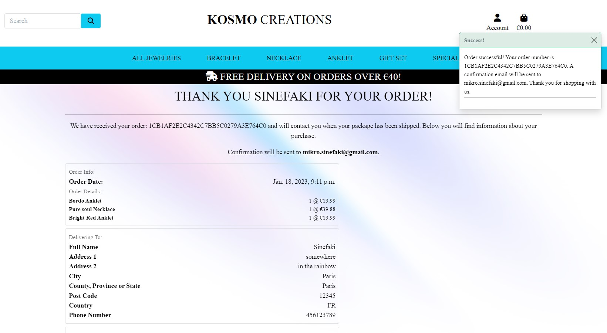
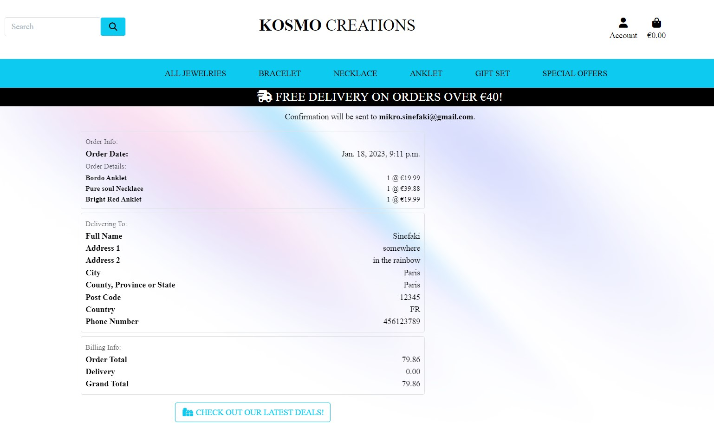
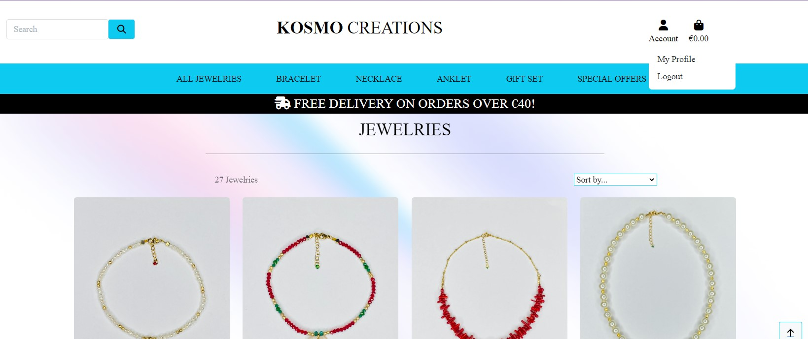
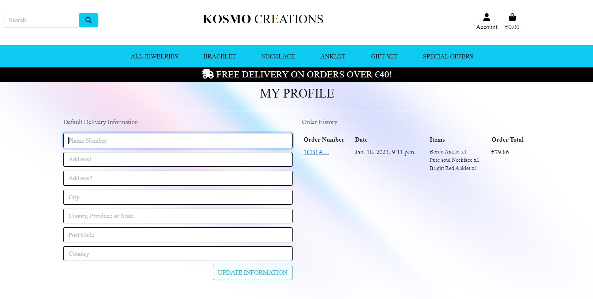
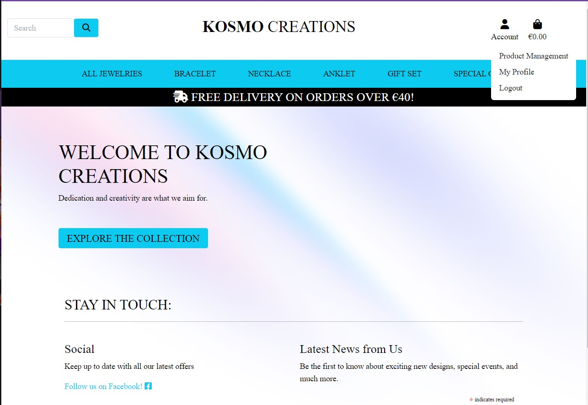
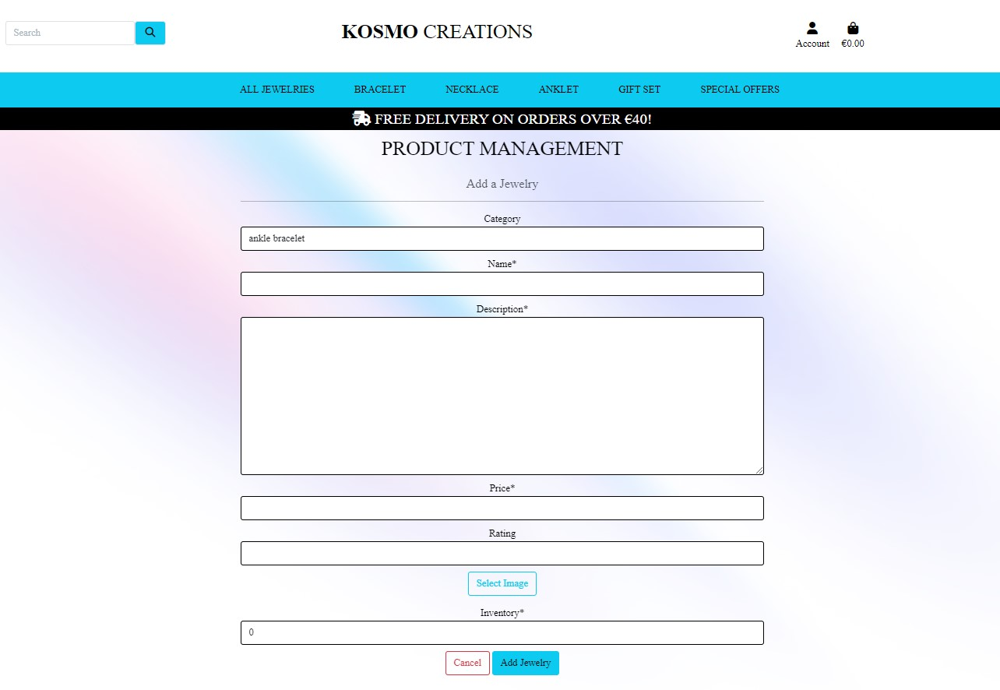

# Welcome to **[Kosmo Creations](https://kosmo-creations.herokuapp.com/)**

The 5th portfolio project for Code Institute. It is a E-commerce web application, click [here](https://kosmo-creations.herokuapp.com/) to have a look.

- [**Purpose of the site**](#purpose-of-the-site)
- [**Why This**](#why-this)
- [**Project planning**](#project-planning)
  - [**Business Model**](#business-model)
  - [**Web Marketing**](#web-marketing)
    - [_Subscribe to Newsletter_](#subscribe-to-newsletter)
    - [_SEO_](#seo)
    - [_GDPR_](#gdpr)
  - [**User Stories**](#user-stories)
  - [**Database Structure**](#database-structure)
  - [**WireFrames**](#wireframes)
  - [**Font and color**](#font-and-color)
  - [**Agile Methodology**](#agile-methodology)
- [**Deployment Site - version 1.0**](#deployment-site-version-10)
  - [**_Landing Page:_**](#landing-page)
  - [**_Jewelries Page:_**](#jewelries-page)
  - [**_Jewelry Detail Page:_**](#jewelry-detail-page)
  - [**_Shopping Cart Page:_**](#shopping-cart-page)
  - [**_Checkout Page_**](#checkout-page)
  - [**_Order confirmation Page_**](#order-confirmation-page)
  - [**_Profile Page_**](#profile-page)
  - [**_Product Management Page_**](#product-management-page)
- [**Testing**](#testing)
- [**Tech Stack**](#tech-stack)
  - [**Languages**](#languages)
  - [**Tools**](#tools)
- [**Credits**](#credits)
- [**Acknowledgments**](#acknowledgments)

<small><i><a href='http://ecotrust-canada.github.io/markdown-toc/'>Table of contents generated with markdown-toc</a></i></small>

## **Purpose of the site**

Site owner’s main objectives are:

- to showcase what we have in store
- to provide solutions of finding the unique gifts for someone you care about
- to increase the customers' satisfaction by accepting custom made request
- to have a platform where users can openly share their experience with us
- to take action on the things need to improve
- to make money of course
- to spread love and kindness by help those in need with donating a % of the revenue to the local animal shelter

Site user’s main objectives are:

- to find the perfect gifts
- to request a custome made gift
- to share experience with others
- to see others review about their experiences
- to have a wishlist on the site
- to support small businesses
- to help with spread love and kindness by knowing the % of your purchase goes to the local animal shelter

---

## **Why This**

The reason that I decided to create a jewelry store for my 5th and last project at CI, is that the designer of those beautiful jewelries – Eudokia Michaelidou holds a very special place in my heart. She is the most generous, kind, beautiful human being inside out. When I first arrived in Cyprus, as a foreign student, with limited knowledge of how things work outside of the college, and no knowledge of Greek, I was clueless and lost. Until I was lucky enough to have met Eudokia. We connected instantly, she said I was her lost child from China. She treated me as her own child.

..._PAUSE_ ... here I should give a bit more info about her situation at that time. She isn’t rich and have a big fat pile of cash laying around so she can just randomly take someone under her wing with no impact on her own life. At that time, she was a single mother with 4 children, no job and living on the government support. Struggling is an understatement to describe her situation, but still she took me in ...

..._RESUME_ ... she shared everything she had with no hesitance. Even treated me better than her own children sometimes. There are no words can describe how grateful I feel towards her, and she is the reason I feel very strong connection with Cyprus and see it as my second home country.

Fast forward today, she started this small business of making jewelries about a year ago, and I really wanted to utilize my newly gained skill to help her to have a digital presence. If Covid has taught me anything, it would be that digital business is the further, without it, you are failing before even start. So here we are, [Kosmo Creations](https://kosmo-creations.herokuapp.com/) with love from Cyprus!

---

## **Project planning**

 

### **Business Model**

It is a B2C business model, with targeted customer being individuals, and focus on single transactions. It is aiming to target individuals who is interested in online shopping, jewelry lover and looking for unique and personalised designs. Or people who want to purchase unique gifts for their loved ones.

### **Web Marketing**

#### _Subscribe to Newsletter_

Customer has the possibility to subscribe to the newsletter to keep informed about latest design, special events. [Mailchimp](https://mailchimp.com/) service was used for this purposes in v0.1.
In v0.2 there was a change has been made regarding newsletter approach. MailChimp was removed, instead I made an newsletter page that any users can view it. In the future, there will be possibility to subscribe and unsubscribe to our newsletter.

#### _SEO_

Reserach on SEO was conducted, keywords that are included in this project were carefully chosen and comparied again their visibility and scores. [Wordtracker](https://www.wordtracker.com/) was used for this purpose.

SEO key words

 

#### _GDPR_

Privacy Policy, one of the most important policy for online business, is also included at the bottom of the home page. To demostrate that we take GDPR very serious. [Privacy Policy Generator](https://www.privacypolicygenerator.info/) was used to generate the privacy policy attached.

Privacy Policy

 

---

 

### **User Stories**

The tasks users can perform depends on their role. On this site, there are admin, first time user and returned users, tasks that they have the authorization to perform are shown in below table, as well as their associated User Stories from [Github](https://github.com/Maya-Claveau/pp5-kosmo-creations/issues). Please see details and implementaion status below:

| No. |                                                         User Story                                                          |  Status |
| --- | :-------------------------------------------------------------------------------------------------------------------------: | ------: |
| 1   |                 [View a list of all products](https://github.com/Maya-Claveau/pp5-kosmo-creations/issues/1)                 |    Done |
| 2   |            [View individual products with details](https://github.com/Maya-Claveau/pp5-kosmo-creations/issues/2)            |    Done |
| 3   |           [Quickly access sales and special offers](https://github.com/Maya-Claveau/pp5-kosmo-creations/issues/3)           |    Done |
| 4   |       [View the total in the shopping cart at anytime](https://github.com/Maya-Claveau/pp5-kosmo-creations/issues/4)        |    Done |
| 5   |                   [Register for an account](https://github.com/Maya-Claveau/pp5-kosmo-creations/issues/5)                   |    Done |
| 6   |        [Receive email confirmation after registration](https://github.com/Maya-Claveau/pp5-kosmo-creations/issues/6)        |    Done |
| 7   |                 [Login/logout to an account](https://github.com/Maya-Claveau/pp5-kosmo-creations/issues/7)                  |    Done |
| 8   |                       [Reset password](https://github.com/Maya-Claveau/pp5-kosmo-creations/issues/8)                        | Backlog |
| 9   |                 [Have a personalised profile](https://github.com/Maya-Claveau/pp5-kosmo-creations/issues/9)                 |    Done |
| 10  |                        [Sort Product](https://github.com/Maya-Claveau/pp5-kosmo-creations/issues/10)                        |    Done |
| 11  |                    [Categorize Products](https://github.com/Maya-Claveau/pp5-kosmo-creations/issues/11)                     |    Done |
| 12  |        [Search for a product by name or description](https://github.com/Maya-Claveau/pp5-kosmo-creations/issues/12)         |    Done |
| 13  |      [See the number of search results after a search](https://github.com/Maya-Claveau/pp5-kosmo-creations/issues/13)       |    Done |
| 14  |            [Easiliy select quantity of a product](https://github.com/Maya-Claveau/pp5-kosmo-creations/issues/14)            |    Done |
| 15  |                  [View shopping bag items](https://github.com/Maya-Claveau/pp5-kosmo-creations/issues/15)                   |    Done |
| 16  | [Modify the quantity of individual items in my shopping bag](https://github.com/Maya-Claveau/pp5-kosmo-creations/issues/16) |    Done |
| 17  |               [Enter the payment information](https://github.com/Maya-Claveau/pp5-kosmo-creations/issues/17)                |    Done |
| 18  |       [Have info prefilled in order confirmation page](https://github.com/Maya-Claveau/pp5-kosmo-creations/issues/18)       |    Done |
| 19  |         [View an order confirmation after checkout](https://github.com/Maya-Claveau/pp5-kosmo-creations/issues/19)          |    Done |
| 20  |         [Receive email confirmation after checkout](https://github.com/Maya-Claveau/pp5-kosmo-creations/issues/20)          |    Done |
| 21  |              [As an admin I can add a product](https://github.com/Maya-Claveau/pp5-kosmo-creations/issues/21)               |    Done |
| 22  |              [As an admin I can edit a product](https://github.com/Maya-Claveau/pp5-kosmo-creations/issues/22)              |    Done |
| 23  |             [As an admin I can delete a product](https://github.com/Maya-Claveau/pp5-kosmo-creations/issues/23)             |    Done |
| 24  |              [View the inventory of a product](https://github.com/Maya-Claveau/pp5-kosmo-creations/issues/24)               | Backlog |
| 25  |                    [View my own wishlist](https://github.com/Maya-Claveau/pp5-kosmo-creations/issues/25)                    |    Done |
| 26  |                        [contact form](https://github.com/Maya-Claveau/pp5-kosmo-creations/issues/26)                        |    Done |
| 27  |                   [View shopping history](https://github.com/Maya-Claveau/pp5-kosmo-creations/issues/27)                    |    Done |
| 28  |    [View the products in the shopping bag for buy later](https://github.com/Maya-Claveau/pp5-kosmo-creations/issues/28)     | Backlog |
| 29  |      [Provide visual feedback after operation by users](https://github.com/Maya-Claveau/pp5-kosmo-creations/issues/29)      |    Done |
| 30  |                      [view newsletter](https://github.com/Maya-Claveau/pp5-kosmo-creations/issues/30)                       |    Done |

Logic

 

### **Database Structure**

Below is the Database structure that this project is based on. There are User, Product, Product-inventory, Order, Review, Wishlist, and shopping cart buy later, you can also see their lationships between each table.

Database Schema

 

### **WireFrames**

Mobile Wireframes

Desktop Wireframes

 

### **Font and color**

I chose Barlow because it looks elegant and easy to read for the users, and a minimum colour palette, because it looks simple and classy.

Font and Color palette

 

### **Agile Methodology**

[Github Project](https://github.com/users/Maya-Claveau/projects/3) was used to implement the Agile methodology. It is very uselful tool to help me keep on track with my tasks and prioritise them accordingly.

---

## **Deployment Site - version 1.0**

### **_Landing Page:_**

- when first land on the home page, user will see logo in the center
- search bar on the left and account and shopping cart on the right
- below is the main navigation bar which tells the user straight away what we have in the store. With the posibility to filter by price, rating, category or to see all
- a welcome message with the button leads to the all jewelries page
- ways of stay in touch with one social platform(for now) - Facebook and the link to our facebook page
- a form where user can sign up for the newsletter to stay informed about our latest news, evens etc
- at the bottom of this page, user will find a privacy policy link because GDPR is ultra important.

Access depending on the roles:

- First time or unregistered users will have the possibility to register for an account
- Registered user can login from here
- Admin can also login from here and manage the products

### **_Jewelries Page:_**

A range of jewelries that the store is offering, here you can also use filter function from nav bar, as well as the sorting function. Here you can see the image of each jewelry, with its name, price, category and ratings. Click on any jewelry will lead you to the next page with more details.

Access depending on the roles:

- All users can view this page, as it will give the maximum exposure of our jewelries
- Admin can edit or delete any jewelry here

### **_Jewelry Detail Page:_**

Here you can see the larger image of the jewelry, in addition to the information you already see from the previous page, there is detailed description to give user more information. If the item is sold out, user will have one button which will lead to all jewelries page. If the item is in stock, user will be able to add it to the shopping cart.

Access depending on the roles:

- All users can view this page, as it will give the maximum exposure of our jewelries
- Admin can also edit or delete any jewelry here

### **_Shopping Cart Page:_**

In this page you will see the image of the jewelry you have added, along with the price info and the possibility of changing the quantity. The subtotal, delivery fee and grand total is displayed to inform the user.

Access depending on the roles:

- First time or unregistered users will NOT have the possibility to proceed to the next step, however, options of register or login is provided.
- Registered user can login from here, if already logged in, user will see the checkout button which will take them to the checkout page
- Admin has the same right as the logged in users.

### **_Checkout Page_**

On the left side there is a form the user need to fill in for example name, email and delivery address. Below it there is the payment details. On the right side, is the order summary displaying the smaller image of the jewelries, name, quantity, subtotal, delivery and grand total.

Access depending on the roles:

- First time or unregistered users will NOT have access to this page.
- Logged in users will be able to fill in the form, as well as the payment details to proceed with the checkout.
- Admin has the same right as the logged in users.

### **_Order confirmation Page_**

When the payment went through successfully, user will land on the order confirmation page, which contains information such as their unique order ID, ordered items' name, quantity, price, delivery address and all the charges.

Access depending on the roles:

- First time or unregistered users will NOT have access to this page.
- Logged in users will see this page with relevant information.
- Admin has the same right as the logged in users.

### **_Profile Page_**

The link to profile under Account is only visible to logged in users. User has the posibility to create a personalisied profile if they wish. Where they can save information such as delivery address, so they can re-use it for future purchase. As well as the order history, including the order number, date, items they have purchased and the order total.

Access depending on the roles:

- First time or unregistered users will NOT have access to this page.
- Logged in users will see this page with relevant information.
- Admin has the same right as the logged in users.

### **_Product Management Page_**

For admin uers only, when they login, under the Account, there is an extra link of Product Management, that leads to the product management page. Where admin users can add, edit, and delete any product.

First time or unregistered user

Registered or logged in user

Admin

---

## **Testing**

Details regarding Testing include Code Validation can be found in [TESTING.md](TESTING.md) file.

---

## **Tech Stack**

### **Languages**

This project is a Full-Stack e-Commerce web application. With the authentication it provide role-based access to the data.

Main Tech used are:

- **python**
- **Django**
- **HTML**
- **CSS**
- **Javascript**
- **postgresql**
- **psycopg2**

### **Tools**

- [Github](https://github.com/) for store and version control of the code

- [Gitpod](https://gitpod.io/workspaces) for editing code

- [Heroku](https://heroku.com/) for deployment

- [ElephantSQL](https://www.elephantsql.com/) for hosting database

- [Stripe](https://stripe.com/) for providng free payment gateway

- [draw.io](https://www.draw.io) for creating database relationship

- [AWS](https://AWS.com) for store the images and css files used in this project

- [Lightshot](https://app.prntscr.com/en/index.html) for creating screenshots

- [GitHub Wiki TOC generator](https://ecotrust-canada.github.io/markdown-toc/) for generating table of content for README.md file

- [techsini.com](https://techsini.com/multi-mockup/index.php) for generating the mock up

- [Bootstrap](https://getbootstrap.com/) was used to speed up the design the style and responsiveness of the website

- [Favicon.io](https://favicon.io/) was used to generate the favicon for the site

- [Mailchimp](https://mailchimp.com/) was used for subscribe newsletters.

- [Privacy Policy Generator](https://www.privacypolicygenerator.info/) was used to generate the privacy policy.

## **Credits**

- Code Institute's **Boutique Ado walkthrough**
- [Youtube](https://youtube.com/) for different tutorials such as bootstrap, css, django etc
- [Very Academy](https://www.youtube.com/@veryacademy) for django related topics
- [Codemy](https://www.youtube.com/@Codemycom) for django related topics
- [Stack Overflow](https://stackoverflow.com/) for different topics
- [Google](https://google.com/) of course, I know I won't survive this without it.

 

## **Acknowledgments**

- Amazing Tutors from Code Institute, they not only helped me to fix the problems, also guide me and provide more information to learn from it. I also learnt how they debug and the thinking process where to look and how to find the problem in the first place. Special shout out to Joshua from the Tutor's team, I lost count on how many times he helped/guided me to figure out where to look and what could be causing the problem. I really couldn't have done it without his support.

- My mentor who is supporting me all the way and giving me more ideas and challenges

- My family, throughout this project, a lot of family time were sacrificed, I am very grateful for their understanding and support.

- CI's Slack community for keeping me sane and knowing I am not alone in this.

THANK YOU ALL!!!
