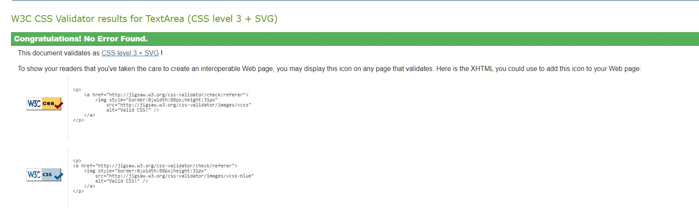
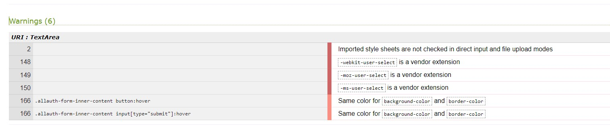
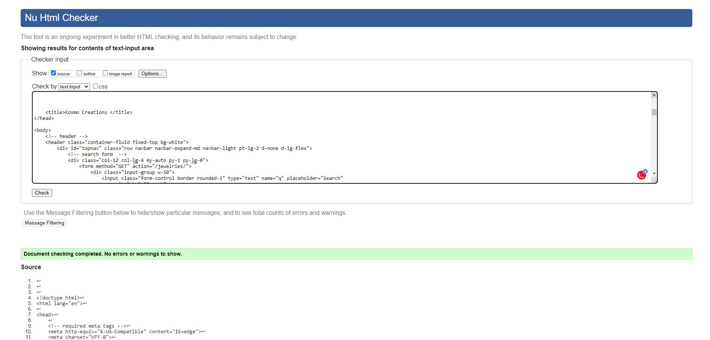
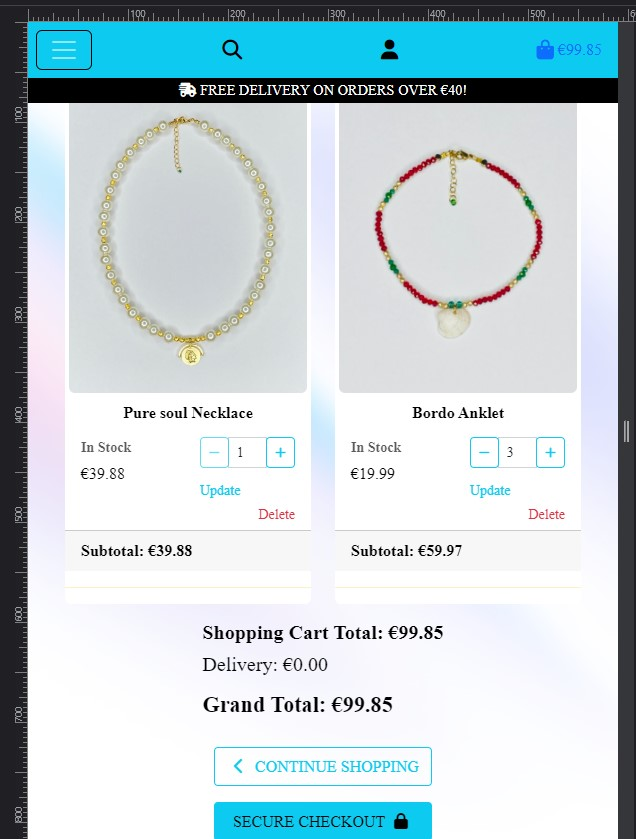

# **Testing**

## **Code Validation**

[Jigsaw CSS validator](https://jigsaw.w3.org/css-validator/) was used to validate CSS code. It passes the validator without errors, however, there are some warnings, you can find the details in the screenshot. I looked into them, and don’t think is critical issue, so I just left them there.

CSS and warnings

 

[W3C Markup Validation Service](https://validator.w3.org/) was used for validate HTML code

HTML validation reports

index.html

contact.html

all_posts.html

signup.html

login.html

logout.html

shared_posts.html

add_post.html

update_post.html

delete_post.html

[CI Python Linter](https://pep8ci.herokuapp.com/) was used for validate python code
No errors were found in the final verion. There was no report generated.

## **Manual Testing**

Testing was done throughout the development, for each feature and on different sized devices, to ensure responsiveness.

Features were tested with different users to ensure testing from different devices, sizes and browsers, to keep an eye for any potetial bugs while in developing stage.

Shopping Cart page

- The position of Update link was not aligned properly, I manage to fix it, but between 576px - 767px, the button for Update and Delete are not aligned correctly.

Shopping Cart

## Below are example of list of things I struggled with:

-
-
-
-
-
-

### **Unfixed bugs:**

Post.object – put it under unfixed bugs Pylint is pythons error message, and unfortunately python can’t see what Django is doing, so as an example, objects are there, python just can’t see that Django is handling the objects.
